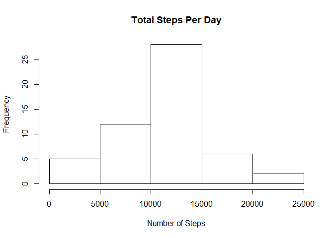
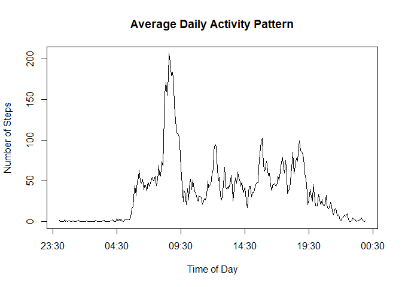
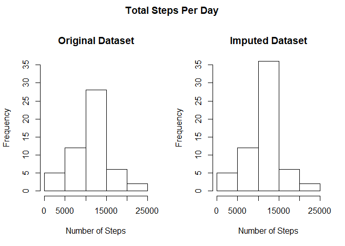
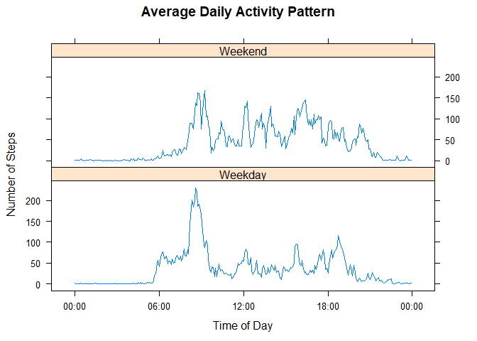

## Loading and preprocessing the data
The data file is unzipped and read into R using the `read.csv()` function.


```r
unzip("activity.zip")
data <- read.csv("activity.csv")
```

The interval column is converted into the format `"%H:%M"` by dividing it by 100, and using the quotient as the hour and the remainder as the minutes.


```r
data$interval <- paste(sprintf("%02d", data$interval %/% 100), sprintf("%02d", data$interval %% 100), sep = ":")
```

## What is mean total number of steps taken per day?
The `aggregate()` function is used to find the total number of steps taken in each day. A histogram of the results is plotted.


```r
totalStepsPerDay <- aggregate(steps ~ date, data, sum)
hist(totalStepsPerDay$steps, xlab = "Number of Steps", main = "Total Steps Per Day")
```

<!-- -->

The `mean()` and `median()` functions are used to calculate the mean and median steps per day.


```r
meanSteps <- mean(totalStepsPerDay$steps)
medianSteps <- median(totalStepsPerDay$steps)
```

The mean is `10766.19` and the median is `10765`.

## What is the average daily activity pattern?
The `aggregate()` function is used to find the average number of steps across all days for each 5-minute time interval. A time series plot of the results is plotted.


```r
dailyActivityPattern <- aggregate(steps ~ interval, data, mean, na.rm = TRUE)
plot(as.POSIXct(dailyActivityPattern$interval, format="%H:%M"), dailyActivityPattern$steps, type = "l", xlab = "Time of Day", ylab = "Number of Steps", main = "Average Daily Activity Pattern")
```

<!-- -->

The `which.max()` function is used to find the 5-minute time interval corresponding to the maximum average number of steps.


```r
maxInterval <- dailyActivityPattern[which.max(dailyActivityPattern$steps), 1]
```

The 5-minute time interval corresponding to the maximum average number of steps is `08:35`.

## Imputing missing values
The `is.na()` function is used to find the missing values in the dataset.


```r
missingValues <- is.na(data$steps)
```

The total number of missing values in the dataset is `2304`.

The missing values in the dataset is imputed using the corresponding average number of steps across all days for that specific time interval.


```r
imputedData <- transform(data, steps = ifelse(is.na(data$steps), dailyActivityPattern$steps[match(data$interval, dailyActivityPattern$interval)], data$steps))
```

As previously, the total number of steps taken in each day is calculated for the imputed dataset and a histogram of the results is plotted alongside a histogram of the original dataset for comparison.


```r
totalStepsPerDayImputed <- aggregate(steps ~ date, imputedData, sum)
par(mfrow = c(1,2), oma = c(0,0,2,0))
hist(totalStepsPerDay$steps, xlab = "Number of Steps", main = "Original Dataset", ylim = c(0,35))
hist(totalStepsPerDayImputed$steps, xlab = "Number of Steps", main = "Imputed Dataset", ylim = c(0,35))
title("Total Steps Per Day", outer = TRUE)
```

<!-- -->

As previously, the mean and the median steps per day is calculated for the imputed dataset.


```r
meanStepsImputed <- mean(totalStepsPerDayImputed$steps)
medianStepsImputed <- median(totalStepsPerDayImputed$steps)
```

The mean is `10766.19` and the median is `10766.19`. 

The mean appears to be unchanged, however the median is slightly lower than that of the original dataset. Overall, the imputed data appears to have increased the total number of steps per day, especially around the centre of the histogram.

## Are there differences in activity patterns between weekdays and weekends?
A new factor variable named dayofweek is created to determine whether the given date is on a weekday or a weekend.


```r
imputedData$dayofweek <- as.factor(ifelse(weekdays(as.Date(imputedData$date)) %in% c("Saturday", "Sunday"), "Weekend", "Weekday"))
```

The `aggregate()` function is used to find the average number of steps across all weekdays and weekends for each 5-minute time interval. Two time series plots of the results are plotted.


```r
dailyActivityPatternImputed <- aggregate(steps ~ interval + dayofweek, imputedData, mean)
library(lattice)
xyplot(dailyActivityPatternImputed$steps ~ as.POSIXct(dailyActivityPatternImputed$interval, format = "%H:%M") | dailyActivityPatternImputed$dayofweek, main = "Average Daily Activity Pattern", xlab = "Time of Day", ylab = "Number of Steps", layout = c(1,2), type = "l", scales = list(x = list(at = seq(as.POSIXct("2018-03-29"), by = "6 hour", length = 5), labels = format(seq(as.POSIXct("2018-03-29"), by = "6 hour", length = 5), "%H:%M"))))
```

<!-- -->
